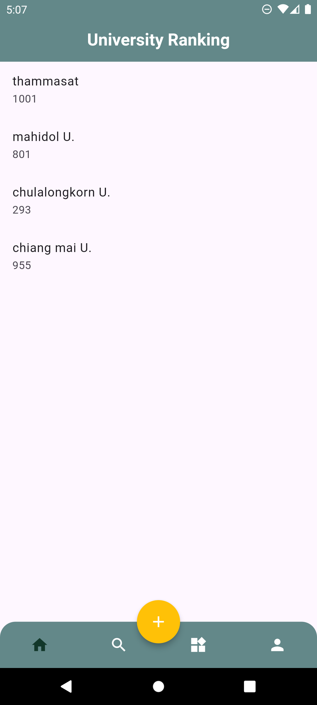
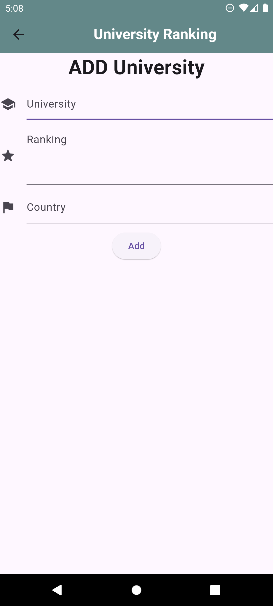
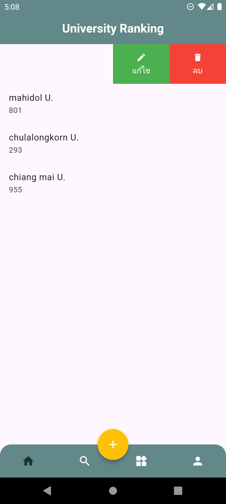
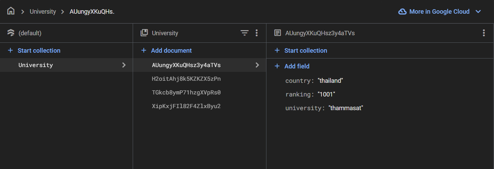

# university

A  Flutter CRUD project.

C(Create) สร้างหรือเพิ่มรายการใหม่

R(Read) อ่านดึงค้นหาหรือดูรายการที่มีอยู่

U(Update) อัปเดตหรือแก้ไขรายการที่มีอยู่

D(Delete) ลบปิดใช้งานหรือลบรายการที่มีอยู่

ในฐานข้อมูล Firebase

